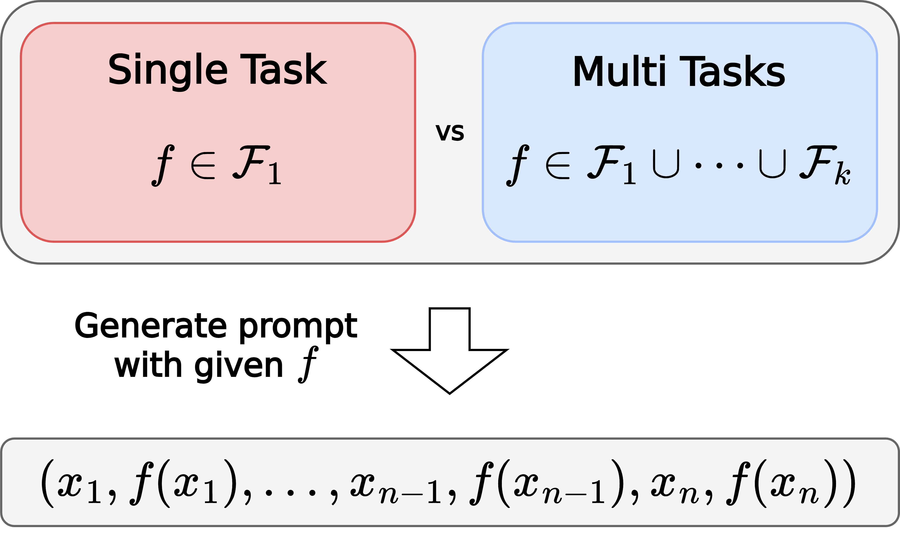
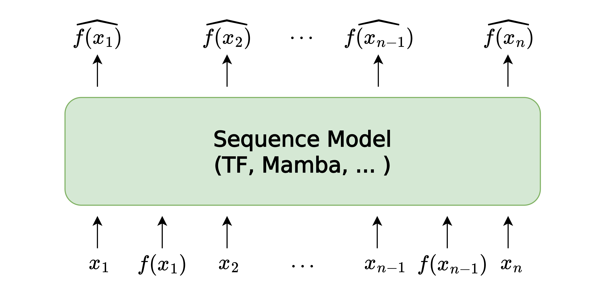

<h1 align='center' style="text-align:center; font-weight:bold; font-size:2.0em; letter-spacing:2.0px;">
    Task Diversity Shortens the ICL Plateau
</h1>

<p align='center' style="text-align:center; font-size:1.25em;">
    <a href="https://jaeyeonkim01.github.io/" target="_blank" style="text-decoration: none; border-bottom: 1px solid;">
        Jaeyeon Kim
    </a>*<sup>1</sup>&nbsp;,&nbsp;
    <a href="https://sehyunkwon.github.io/" target="_blank" style="text-decoration: none; border-bottom: 1px solid;">
        Sehyun Kwon
    </a>*<sup>2</sup>&nbsp;,&nbsp;
    <a href="https://lthilnklover.github.io/" target="_blank" style="text-decoration: none; border-bottom: 1px solid;">
        Joo Young Choi
    </a><sup>2,3</sup>&nbsp;,&nbsp;
    <a href="https://pages.cs.wisc.edu/~jjhpark/" target="_blank" style="text-decoration: none; border-bottom: 1px solid;">
        Jongho Park
    </a><sup>3</sup>&nbsp;,&nbsp; 
    <a href="https://sites.google.com/view/jaewoongcho" target="_blank" style="text-decoration: none; border-bottom: 1px solid;">
        Jaewoong Cho
    </a><sup>3</sup>&nbsp;,&nbsp; 
    <a href="https://jasondlee88.github.io/" target="_blank" style="text-decoration: none; border-bottom: 1px solid;">
        Jason D. Lee
    </a><sup>4</sup>&nbsp;,&nbsp; 
    <a href="https://ernestryu.com/" target="_blank" style="text-decoration: none; border-bottom: 1px solid;">
        Ernest K. Ryu
    </a><sup>5</sup>
    <br><br>
    <sup>1</sup>Harvard University&nbsp;&nbsp;&nbsp;
    <sup>2</sup>Seoul National University&nbsp;&nbsp;&nbsp;
    <sup>3</sup>KRAFTON AI&nbsp;&nbsp;&nbsp;
    <sup>4</sup>Princeton University&nbsp;&nbsp;&nbsp;
    <sup>5</sup>UCLA&nbsp;&nbsp;&nbsp;
    <sup>*</sup>co-first author&nbsp;&nbsp;&nbsp;
</p>

<p align='center'>
<b><em>Preprint</em></b><br>
</p>

<p align='center' style="text-align:center; font-size:2.5em;">
<b><a href="https://arxiv.org/abs/2410.05448" target="_blank" style="text-decoration: none;">[Paper]</a></b>
</p>

## TL;DR
 In this work, we reveal that training on **multiple diverse ICL tasks simultaneously shortens the loss plateaus**, making each task easier to learn. This finding is surprising as it contradicts the natural intuition that the combined complexity of multiple ICL tasks would lengthen the learning process, not shorten it.

<div style="display: flex; justify-content: center; align-items: center; margin-left: 5%;">
    
    
</div>


## Notice
The code will be released soon!

## Citation
```latex
@inproceedings{taskdiversityicl2024,
  title={Task Diversity Shortens the ICL Plateau},
  author={Jaeyeon Kim, Sehyun Kwon, Joo Young Choi, Jongho Park, Jaewoong Cho, Jason D. Lee, Ernest K. Ryu},
  booktitle={arXiv},
  year={2024}
}
